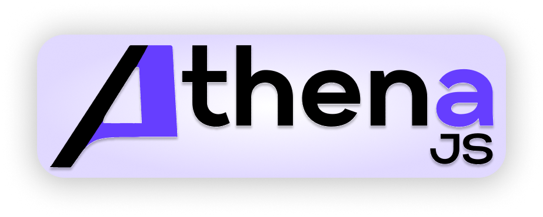

  

 

&nbsp;&nbsp;&nbsp;
&nbsp;&nbsp;&nbsp;

 

&nbsp;&nbsp;&nbsp;
&nbsp;&nbsp;&nbsp;

<strong><a href="#Features">Features</a></strong>
•
<strong><a href="#questions-and-support">Questions</a></strong>
•
<strong><a href="#Contributing">Contributing</a></strong>
•
<strong><a href="#Contributing">Read More</a></strong>
•
<strong><a href="#Contributing">The Team</a></strong>

## What is AthenaJS?

AthenaJS is a component visualizer workshop that allows developers to quickly develop and edit their React 
components in isolation without codebase integration.  

**Easy to use**: AthenaJS is a standalone electron application that allows developers to import their
own React components or create components from scratch within the application's code editor.

**Dynamic**: Developers can mock HTTP requests, style, and change the functionality of their components within the application's code editors. Changes are reflected in the renderer with the press of a button!

**UI Mode**: After developers have created/edited their react components, they can navigate to the UI Mode section and prototype UIs using components from their library.

    

## Documentation & Installation

You can find documentation and download the app on our <a href = '#'> website </a>

If you just want to download the app, click <a href = '#'> here </a>

**Mac users**: The application needs to be approved in the "Security and Privacy" tab before it can be run.

    

## Features

Interested in what you can do with AthenaJS? Here is a quick summary of all the great features you can start developing with!

Please note AthenaJS only works for ***functional components***, but work is currently being done to add support for class components!

### Developing a Component from Scratch

https://user-images.githubusercontent.com/35904733/230973355-08ee1f98-7428-48ec-9b7a-d8a31f8cd1d2.mov

 

💠 You can develop components from scratch and export them to your React project using our code editors!  The JSX editor holds the return statement of the component and the body contains everything else (your hooks, functions, etc.).  Press update view to view your changes live in the component renderer.  Save your progress by choosing a name for your component and saving it to the component library.

### Upload and Edit Components

https://user-images.githubusercontent.com/35904733/230982140-5f46aa3d-eb19-4bde-be6c-f82d078a858e.mov

 

💠 If you already have components built for your project and want to edit them, open the file explorer and import any of your React components! Our parser will inject your code into the editors so you can get started easily.  Simply define any props your component relies on in the body editor and update the view to get your component working in the app!

### Fetch Mock Integration

https://user-images.githubusercontent.com/35904733/230982230-daf91647-7ccb-4ff0-b57f-6e0ce4dc4567.mov

 

💠 If your component makes an http request with fetch, AthenaJS includes feck-motch integration to mock the response.  If you are interested in all of the great features available to you with feck-motch, check out the <a href = 'https://www.wheresrhys.co.uk/fetch-mock/'> documentation </a>.  By default, our settings intercept all requests and respond with an object {data: 'mock data'} to get you started quickly.

### Styling Your Components

https://user-images.githubusercontent.com/35904733/230982240-82f1cc69-ff5b-49c7-aa61-be5cfd357268.mov

 

💠 AthenaJS includes styled-components integration, check out the <a href = 'https://styled-components.com/docs'> documentation </a> here to get started.  Styled components lets you write actual CSS code to style your components, so you can get started quick and easy! Declare your styled component variable in the body editor and write CSS or copy over code from your CSS file to quickly style your component! 

### Compare Component Render Times

https://user-images.githubusercontent.com/35904733/230982261-e5e4f161-35d0-4cfb-a17d-f2e5feda18f6.mov

 

💠 Curious which components are causing or have the potential to cause a bottleneck in your application? Every time you render a new component, the render time is captured using the React Profiler API, the same API that React Dev Tools are built on.  Render times can be added to a bar graph with the click of a button to easily compare render times across different components.

### Save Components

https://user-images.githubusercontent.com/35904733/230982276-2df23884-b1c8-4d6c-bc5d-93f6ff4173f1.mov

 

💠 Press 'Save Library' to save your component library to your home directory.  Your components will be persisted between sessions, so you can easily pick up from where you left off.  Render any of your components and make changes to them, delete them from your library, or export them as a jsx file to easily integrate the components you develop into your React projects.

### UI Whiteboard

https://user-images.githubusercontent.com/35904733/230982285-5e3f8933-2ca8-49a4-a995-e42e5acd0fe8.mov

 

💠 Once you build a component library, you can easily prototype UIs using the drag and drop UI whiteboard.  The whiteboard area can be saved as a screenshot to your downloads folder by pressing the screenshot button on the top right portion of the screen.   

💠 One of the team's favorite uses of this tool is to compare similar components.  Not sure which navbar or button you like best? Add them to the whiteboard and compare them side-by-side!

## Questions and Support

If you have any questions or need help with the project, please don't hesitate to ask! You can reach out to us on [Discord](https://discord.gg/6xkMNXtBYp) or [create an issue](https://github.com/oslabs-beta/Athena/issues/new/choose) on this repo.

## Contributing

Navigate to the [CONTRIBUTING.md](CONTRIBUTING.md) file to learn how you can contribute to AthenaJS!

    

## Read More

Check out our <a href = '#'> Medium article </a> to read more!

## The Team

***AthenaJS Core Team***

| Developed By       | Github          | LinkedIn        |
| :------------------: | :-------------: | :-------------: |
| Christopher Long   |  |  |
| Daniel Chang       |  |  |
| Derrick Oh         |  |  |
| Matthew Fukudome   |  |  |
| Ryan Motamen       |  |  |

## How is the repo structured?

The Athena JS repo is managed as a monorepo check out the [CONTRIBUTING.md](CONTRIBUTING.md) for development and checkout for the doc website.

## License 

Athena is [MIT licensed](https://github.com/oslabs-beta/Athena/blob/main/LICENSE). 

